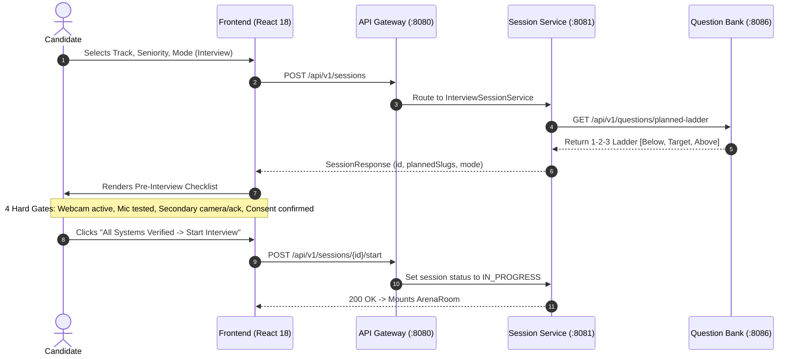
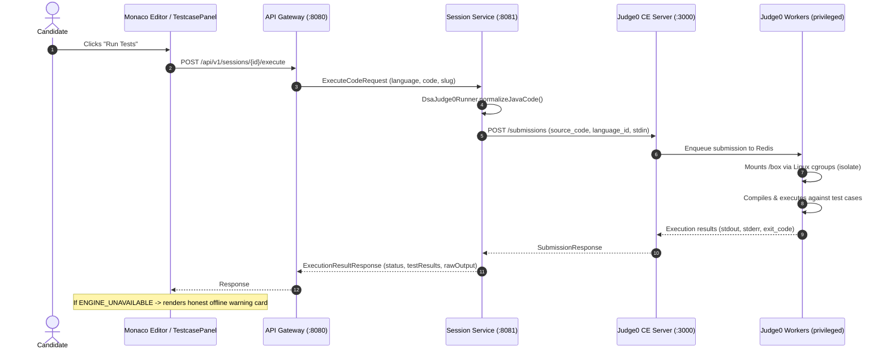
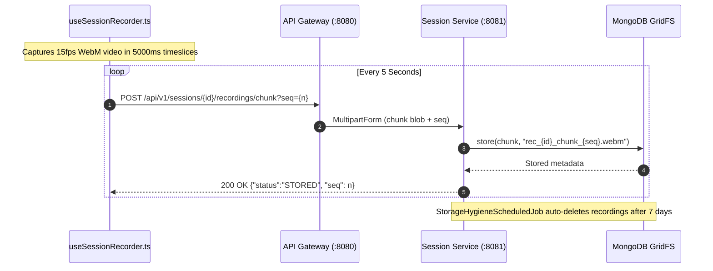

# System Architecture Overview

AI Interview OS is an autonomous multi-track technical assessment and Socratic practice platform built on a distributed microservices architecture. It evaluates candidates across 6 specialized tracks using zero-trust container sandboxes, real-time multimodal AI orchestration, continuous video proctoring, and comprehensive 360° diagnostic reporting.

---

## 1. Executive Summary

- **8-Service Spring Cloud Ecosystem**: Autonomous microservices connected via Netflix Eureka discovery and Spring Cloud Gateway.
- **6 Evaluation Tracks**:
  1. **Algorithms & Data Structures (DSA)**: Standard I/O execution via Judge0 CE sandboxes.
  2. **SQL & Database Engineering**: Multi-tenant relational execution in ephemeral PostgreSQL schemas.
  3. **Low-Level Design (LLD)**: Multi-file Spring Boot / Maven workspaces with live unit testing.
  4. **High-Level System Design (HLD)**: Interactive canvas whiteboard with vision multimodal evaluation.
  5. **Behavioral & Leadership**: STAR-structured dialogue with trade-off and depth probing.
  6. **Resume-Based Deep Dive**: Contextual interviews grounded in candidate's uploaded resume.
- **Dual Operating Modes**:
  - **Proctored Interview**: Hard checklist gates (webcam, mic, companion pairing, consent), curated 1-2-3 question ladders, continuous recording, and anti-cheat telemetry.
  - **Playground Practice**: Instant unconstrained access, Socratic coaching by Coach Sam, progressive hints, and catalog exploration.
- **48 Seeded Production Problems**: Curated across tracks and difficulty tiers (Junior, Mid, Senior, Staff) with verified sample test cases and constraint invariants.

---

## 2. Microservice Map & Service Port Topology

```
+---------------------------------------------------------------------------------------------------+
|                                      FRONTEND (Vite / React 18)                                   |
|                                         http://localhost:5173                                     |
+-------------------------------------------------+-------------------------------------------------+
                                                  |
                                                  v
+---------------------------------------------------------------------------------------------------+
|                                   API GATEWAY SERVICE (:8080)                                     |
|              Spring Cloud Gateway, Global CORS, Docker DNS Routing (ADR-004)                      |
+-------+-----------------------+-----------------+-----------------+---------------+---------------+
        |                       |                 |                 |               |
        v                       v                 v                 v               v
+---------------+       +-----------------+-----------------+---------------+---------------+
| session       |       | ai-orchestrator | proctor         | evaluation    | question-bank |
| service       |       | service         | sentinel        | report        | service       |
| (:8081)       |       | (:8082)         | (:8083)         | (:8084)       | (:8086)       |
+---------------+       +-----------------+-----------------+---------------+---------------+
        |                                                                           |
        +-----------------------------------+                                       |
        |                                   |                                       v
        v                                   v                               +---------------+
+---------------+                   +---------------+                       | MongoDB 7     |
| PostgreSQL 16 |                   | MongoDB 7     |                       | (Questions)   |
| (Relational)  |                   | (Document +   |                       +---------------+
+---------------+                   |  GridFS)      |
                                    +---------------+
```

> **Edge Consolidation & RAM Reduction (ADR-004 / SPEC-002)**: In single-node laptop deployments, `cloud-config-server` (:8888) and `service-discovery-service` (:8761) are retired in favor of Docker internal DNS and embedded profile inlining, reducing JVM memory consumption by ~750MB and guaranteeing a total platform footprint **<5GB** (capped at ~4.7GB).

### Service Responsibilities

| Service | Internal Port | Primary Responsibilities | Data Store | Memory Limit |
|---|---|---|---|---|
| [`api-gateway-service`](../api-gateway-service) | `8080` | Reverse proxy, global CORS, BYOK header forwarding, Docker DNS routing. | None (Stateless) | 256MB |
| [`interview-session-service`](../interview-session-service) | `8081` | Session lifecycle, code execution dispatch, MongoDB transcript, GridFS chunk recording. | PostgreSQL + MongoDB + GridFS | 512MB |
| [`ai-orchestrator-service`](../ai-orchestrator-service) | `8082` | Multimodal AI routing (Ollama, Groq, Gemini), dialogue memory builder, deterministic post-guards, STT. | None (External APIs) | 512MB |
| [`proctor-sentinel-service`](../proctor-sentinel-service) | `8083` | Biometric telemetry, tab switch tracking, keystroke dynamics, copy-paste heuristics. | PostgreSQL | 384MB |
| [`evaluation-report-service`](../evaluation-report-service) | `8084` | 360° competency rubric synthesis, radar dimensions, PDF transcript generation, progress ledger. | PostgreSQL | 512MB |
| [`question-bank-service`](../question-bank-service) | `8086` | Question catalog management, markdown parsing, seed ladders, category filtering. | MongoDB | 384MB |

---

## 3. Data Flow Pipelines

### A. Session Creation & Hardware Verification Flow



### B. Code Execution Sandbox Pipeline



### C. Continuous Session Recording Pipeline



---

## 4. Technology Stack

- **Application Framework**: Spring Boot 3.2.x, Spring Cloud 2023.0.x, Java 21 (Temurin).
- **Client Presentation**: React 18, Vite 8, TypeScript 5, Tailwind CSS 4, Monaco Editor, Lucide Icons.
- **Relational Persistence**: PostgreSQL 16 (session metadata, questions, rubric evaluations).
- **Document & Blob Storage**: MongoDB 7 (full session transcript documents, GridFS audio/video chunks).
- **Zero-Trust Sandboxes**: Judge0 CE 1.13.1 (DSA), PostgreSQL 13 Ephemeral (SQL), Maven 3.9 Container (LLD).
- **AI Inference Tier**: Groq Cloud API (LPU hardware: `gpt-oss-120b`, `qwen-2.5-32b`, `whisper-large-v3`), Ollama (local fallback).
- **Telemetry & Observability**: Prometheus metrics, Grafana dashboards, Grafana Loki log aggregation, OpenTelemetry tracing.

---

## 5. Key Architectural Decisions (ADR References)

For detailed historical context, trade-off analyses, and alternatives considered, reference the formal Architecture Decision Records:
- [**ADR 001: Monolith to Microservices Split**](ADR/001-monolith-to-microservices.md)
- [**ADR 002: Code Runner Isolation Strategy**](ADR/002-code-runner-isolation.md)
- [**ADR 003: AI Evaluation Pipeline & Deterministic Guarding**](ADR/003-ai-evaluation-pipeline.md)
- [**ADR 004: Edge Service Consolidation & Execution Engine Extraction Seam**](ADR/004-edge-service-consolidation.md) *(Status: Accepted)*

---

## 6. Local-First Architecture & Privacy Purity (SPEC-003)

The platform defaults to local AI providers when available:
- **LLM Dialogue & Rubrics**: Local Ollama (`qwen2.5-coder:7b`, `llama3.2:3b`) with automatic fallback to Groq / Gemini.
- **STT (Speech-to-Text)**: Local Whisper.cpp sidecar (:8178) or browser Web Speech API with fallback to Groq Whisper.
- **Cloud Egress Detection**: `EgressTracker` instruments all outgoing AI requests. The UI displays `"🔒 100% Local"` when zero cloud requests have been made, or `"☁️ X Cloud Calls"` if cloud fallback is activated.
- **Zero API Key Requirement**: The platform boots and runs DSA, LLD, SQL, and Architecture interviews entirely offline without requiring any cloud API keys.

---

## ⚠️ DO NOT (Architectural Constraints)

> [!CAUTION]
> **STRICT ARCHITECTURAL CONSTRAINTS FOR FUTURE DEVELOPERS AND LLMs:**

1. **Topology changes (splits OR merges) require an Accepted ADR.** The current 8-service boundary is intentionally balanced between build velocity, domain autonomy, and operational simplicity. Any consolidation (such as proposed [ADR-004](ADR/004-edge-service-consolidation.md)) or extraction (such as the M14 execution engine seam) requires a formal ADR and staged migration.
2. **Do NOT replace Judge0 with custom container runners for DSA.** Judge0 CE provides battle-tested memory and CPU isolation using Linux `isolate`. Rebuilding a custom runner exposes the host to sandbox escapes and compiler fork bombs.
3. **Do NOT bypass the API Gateway.** All client communications must transit `api-gateway-service:8080`. Bypassing the gateway breaks credential redaction, rate limiting, and CORS headers.
4. **Do NOT consolidate polyglot persistence into a single database.** Relational state requires ACID foreign keys in PostgreSQL; conversational transcripts and binary recording chunks require MongoDB documents and GridFS streaming.
5. **Do NOT introduce an asynchronous message broker (Kafka/RabbitMQ).** Synchronous REST with non-blocking HTTP and MongoDB outbox patterns avoids distributed messaging complexity for interactive interview sessions.
6. **Do NOT run candidate code directly on the host.** Every execution MUST take place inside an ephemeral container or chroot jail.
